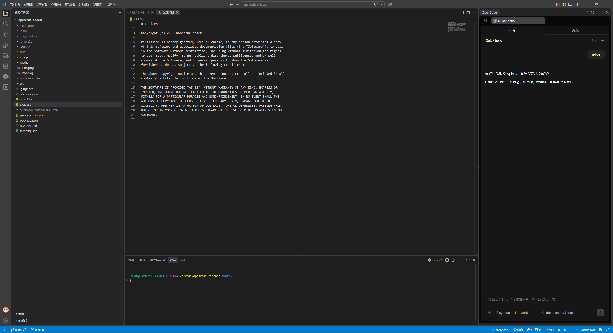

# OpenCode WebUI Sidebar / OpenCode WebUI 侧边栏

[](https://marketplace.visualstudio.com/items?itemName=hahahehe.opencode-webui-sidebar)
[](https://marketplace.visualstudio.com/items?itemName=hahahehe.opencode-webui-sidebar)
[](LICENSE)

[中文](#中文) | [English](#english)

---

## 中文

**在 VS Code 侧边栏里使用官方的 OpenCode WebUI。**

### 现有的 OpenCode 插件,为什么都不好用?

Claude Code 和 Codex 都有好用的 VS Code 扩展,但当你想给 OpenCode 找一个时,却发现为啥都不怎么好用?

- ❌ **官方 VS Code 插件**——在 VS Code 终端面板里跑一个终端 UI,体验非常别扭，新版本遥遥无期
- ❌ **第三方 UI 插件**——opencode 迭代飞快,插件作者跟不上,聊天界面停留在几个版本前，很多都没法正常用了
- ❌ **第三方 opencode web UI 集成插件**——受限于opencode开放的接口,此类项目集成度低,项目页展示异常,可能看不到之前的会话列表,只能新建会话
- ❌ **自己重写**——重写意味着滞后、缺功能、bug 修不完

### OpenCode WebUI Sidebar 的思路:官方 WebUI 已经很完善,直接用它,通过注入的方式提高插件的效果

OpenCode 官方的 WebUI 已经具备一切:完整的聊天流、会话管理、内嵌终端、文件差异、权限审批、MCP 工具展示……**这套界面由 opencode 官方团队持续打磨,永远最新。**

所以这个扩展只做一件事:**把官方 WebUI 无损装进 VS Code 侧边栏**。

- ✅ **功能零缺失零滞后**——官方 WebUI 有的全都有,opencode 升级即升级,插件本身永远不需要"跟进适配"
- ✅ **打开项目即用**——自动定位到当前工作区的项目页,历史会话整齐排列,新建的会话也能实时展示在会话列表
- ✅ **侧边栏体验**——辅助侧栏常驻(`Ctrl+Alt+B` 呼出)
- ✅ **主题实时同步**——VS Code 换深浅主题,OpenCode 跟着换,毫无违和
- ✅ **终端、SSE、WebSocket 全透传**——PTY 终端和事件流在侧边栏里和浏览器里一模一样

### 展示

**项目页:打开项目即自动定位,历史会话一目了然**


**对话页:官方 WebUI 完整体验,常驻侧边栏** 建议使用 Ctrl+Alt+B 切换辅助侧栏


**深色主题:VS Code 换主题,OpenCode 实时跟随,毫无违和**



### 快速开始

1. 安装 [OpenCode CLI](https://opencode.ai) 并确保 `opencode --version` 可用
2. 安装本扩展(从 VS Marketplace 或 vsix)
3. 打开任意项目文件夹 → 点击侧边栏的 OpenCode 图标 → 开聊

### 使用技巧

- **重启服务**——点击视图标题栏的 `⟳` 按钮：改了 `opencode.json` 等配置后，点一下立即重启 `opencode serve`，新配置马上生效，无需重载 VS Code 窗口
- **在浏览器打开**——点击视图标题栏的 `↗` 按钮：在系统浏览器里打开当前 WebUI，方便单独使用或配合端口转发

### 工作原理

```
VS Code 侧边栏 → WebviewView
    └─ <iframe sandbox> ──► 本地反向代理 http://127.0.0.1:<port>/
                                   └─► opencode serve (127.0.0.1)
主题链路: VS Code 主题切换 → postMessage → iframe shim → 实时换肤
```

扩展不实现任何业务逻辑:启动一个 `opencode serve`,用薄反向代理解决 iframe 嵌入限制并注入工作区绑定/主题 shim,其余一切交给官方 WebUI。这也意味着:**插件本身几乎不会坏**——坏的只会是 opencode,而修 opencode 不是你的事。

### 平台支持

| Windows | macOS | Linux |
|:---:|:---:|:---:|
| ✅ | ✅ | ✅ |

> 仅限本地场景;Remote-SSH / DevContainer 需端口转发,后续版本支持。

### 设置

| 设置项 | 默认 | 说明 |
|---|---|---|
| `opencodeSidebar.serverPath` | `""` | opencode 可执行文件路径;留空使用 PATH 中的 `opencode` |
| `opencodeSidebar.proxyPort` | `0` | 本地代理端口;`0` 表示随机空闲端口 |

---

## English

**Use the official OpenCode WebUI right inside your VS Code sidebar.**

### Why do existing OpenCode extensions suck?

Claude Code and Codex both have great VS Code extensions. Try to find one for OpenCode and... why are they all so painful to use?

Honestly:

- ❌ **The official VS Code extension** — a terminal UI running in the terminal panel. Feels extremely awkward, and a proper new version is nowhere in sight
- ❌ **Third-party UI extensions** — opencode moves fast, extension authors can't keep up. The chat UI lags versions behind, and many no longer work at all
- ❌ **Third-party WebUI integration extensions** — constrained by the APIs opencode exposes, these integrate poorly: the project page displays incorrectly, you may not see your previous session list at all, and can only create new sessions
- ❌ **Rolling your own** — rewriting means lagging behind, missing features, and endless bugs

### The OpenCode WebUI Sidebar approach: the official WebUI is already great — just use it, and enhance it through injection

The official OpenCode WebUI already has everything: full chat streams, session management, embedded terminal, file diffs, permission approvals, MCP tool inspection... **polished continuously by the opencode team, always up to date.**

So this extension does exactly one thing: **embed the official WebUI losslessly into the VS Code sidebar.**

- ✅ **Zero missing features, zero lag** — everything the official WebUI has, you get. When opencode upgrades, so do you. This extension never needs "catching up"
- ✅ **Open a project and go** — automatically opens the current workspace's project page with its full session history, and newly created sessions appear in the session list in real time
- ✅ **Sidebar experience** — lives in the secondary sidebar (`Ctrl+Alt+B`)
- ✅ **Live theme sync** — switch VS Code between light/dark and OpenCode follows instantly
- ✅ **Terminal, SSE, WebSocket — fully passthrough** — PTY terminals and event streams behave exactly like in the browser

### Demo

**Project page: opens your workspace automatically, session history at a glance**


**Chat page: the full official WebUI, docked in your sidebar** — press `Ctrl+Alt+B` to toggle the secondary sidebar


**Dark theme: switch your VS Code theme and OpenCode follows instantly — seamless**


### Getting Started

1. Install the [OpenCode CLI](https://opencode.ai) and make sure `opencode --version` works
2. Install this extension (from VS Marketplace or vsix)
3. Open any project folder → click the OpenCode icon in the sidebar → start chatting

### Usage Tips

- **Restart server** — click the `⟳` button in the view title bar: after editing `opencode.json` or other config, one click restarts `opencode serve` and the new config takes effect immediately — no need to reload the VS Code window
- **Open in browser** — click the `↗` button in the view title bar: opens the current WebUI in your system browser, handy for standalone use or combined with port forwarding

### How it works

```
VS Code sidebar → WebviewView
    └─ <iframe sandbox> ──► local reverse proxy http://127.0.0.1:<port>/
                                   └─► opencode serve (127.0.0.1)
Theme: VS Code theme change → postMessage → iframe shim → live reskin
```

The extension implements zero business logic: it spawns an `opencode serve`, puts a thin reverse proxy in front of it to solve iframe embedding restrictions and inject a workspace-binding/theme shim, and leaves everything else to the official WebUI. Which means: **this extension can barely break** — the only thing that breaks is opencode itself, and fixing that isn't your job.

### Platform Support

| Windows | macOS | Linux |
|:---:|:---:|:---:|
| ✅ | ✅ | ✅ |

> Local sessions only; Remote-SSH / DevContainer require port forwarding — planned for a future release.

### Settings

| Setting | Default | Description |
|---|---|---|
| `opencodeSidebar.serverPath` | `""` | Path to the opencode executable. Leave empty to use `opencode` from PATH |
| `opencodeSidebar.proxyPort` | `0` | Port for the local proxy. `0` picks a random free port |

### License

[MIT](LICENSE)
